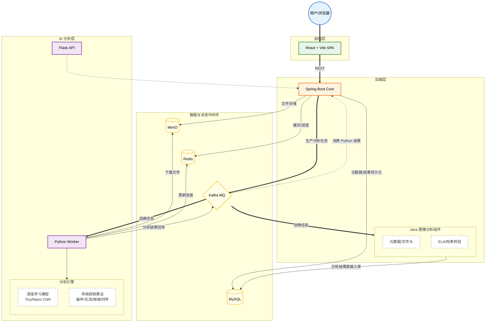

# DeepFake 取证分析系统

一款功能全面的多媒体取证工具,用于检测和分析 Deepfake、数字篡改及 AI 生成的合成媒体内容。

## 项目概览

本系统基于混合架构设计,整合深度学习模型、传统取证算法与现代化 Web 技术栈,为取证分析人员提供自动化、高准确度的多媒体真伪鉴定能力。支持图像与视频的多维度分析,涵盖元数据检验、噪声模式识别、光流异常检测、频域分析等多种技术手段。

### 核心能力

- **AI 驱动的深度伪造检测**：基于 CNN 模型的图像与视频篡改识别
- **传统取证算法集成**：ELA 误差分析、噪声模式分析、复制-移动检测、时序不一致性检测
- **元数据深度分析**：EXIF 信息提取、文件头部校验、哈希完整性验证
- **分布式异步任务处理**：基于 Kafka 的高性能分析任务调度
- **大文件分块上传**：支持断点续传与实时进度追踪
- **项目化管理**：多项目隔离、文件归档与批量分析

### 技术栈

| 层级 | 技术选型 |
|------|---------|
| **前端** | React 18 + TypeScript + Vite + Ant Design |
| **后端** | Spring Boot 3.5 + Java 17 + Maven |
| **AI 分析服务** | Python 3.10+ + PyTorch + Flask + OpenCV |
| **数据库** | MySQL 8.0 + JPA/Hibernate |
| **缓存** | Redis 7 + Caffeine |
| **消息队列** | Apache Kafka 3.9 |
| **对象存储** | MinIO |
| **容器化** | Docker + Docker Compose |

## 系统架构

本项目采用前后端分离的微服务架构,通过 Docker 统一管理基础设施,各服务模块松耦合设计。



### 架构说明

#### 1. Docker 基础设施层
- **MySQL 8**：持久化存储用户、项目、文件元数据及分析结果（端口 3306）
- **Redis 7**：缓存热数据与实时任务进度（端口 6379）
- **Kafka 3.9**：异步任务队列,解耦后端与 AI 分析服务（端口 9092）
- **MinIO**：对象存储服务,存储上传的图像/视频文件（端口 9000,管理界面 9001）

#### 2. 后端服务层（端口 8082）
基于 Spring Boot 构建的 RESTful API 服务,核心模块包括：

- **上传模块（upload）**：分块上传、断点续传、MD5 校验、文件类型验证
- **元数据分析模块（metadata）**：EXIF 解析、文件头分析、哈希计算
- **传统分析模块（traditional）**：触发与管理传统取证算法任务
- **AI 分析模块（analysis）**：触发与管理深度学习模型推理任务
- **项目管理模块（project）**：多项目隔离、文件归档、批量分析
- **认证模块（auth）**：用户注册/登录、JWT 令牌、邮箱验证

#### 3. 前端应用层（端口 3000）
React + TypeScript 单页应用,主要页面：

- **项目列表页**：创建/管理多个取证项目
- **文件上传页**：拖拽上传、批量上传、进度监控
- **文件列表页**：文件预览、过滤搜索、批量操作
- **分析结果页**：可视化展示分析结果、风险评分、详情查看
- **用户中心**：账户管理、邮箱验证、密码重置

#### 4. AI 分析服务层（端口 7000）
Python 驱动的分析引擎,双模式运行：

- **Flask API 模式**：提供同步 HTTP 接口,快速响应简单查询
- **Kafka Worker 模式**：消费异步任务,执行耗时的模型推理与算法分析

**支持的分析算法**：
- **图像 AI 分析**：基于 CNN 的 Deepfake 检测
- **视频噪声模式分析**：检测压缩/合成引入的噪声异常
- **光流分析**：识别运动矢量的不自然断裂
- **频域分析**：检测频谱能量分布异常
- **时序不一致性检测**：识别帧间闪烁、表情跳变
- **复制-移动检测**：识别视频中的重复区域

## 快速开始

### 环境要求

| 组件 | 版本要求 |
|------|---------|
| Docker Desktop | 最新版 |
| Java JDK | 17+ |
| Maven | 3.9+ |
| Node.js | 20.16+ |
| Python | 3.10+ |
| GPU（可选） | CUDA 11.8+ / NVIDIA GPU（用于加速 AI 推理） |

### 完整启动流程

#### 步骤 1：启动 Docker 基础设施

**Windows（PowerShell）**：
```powershell
# 正常启动
.\start-docker.ps1

# 清理后重新启动
.\start-docker.ps1 -Clean

# 检查服务状态
.\status-docker.ps1
```

**Linux/macOS**：
```bash
chmod +x start-docker.sh
./start-docker.sh

# 检查服务状态
docker-compose ps
```

等待所有服务健康检查通过（约 1-2 分钟）。

#### 步骤 2：启动后端服务

```powershell
cd backend

# 编译项目
mvn clean compile

# 设置数据库密码（需与 Docker 中配置一致）
# Windows PowerShell
$env:MYSQL_ROOT_PASSWORD="changeme"
# Linux/macOS
export MYSQL_ROOT_PASSWORD="changeme"

# 启动 Spring Boot
mvn spring-boot:run
```

后端服务启动于：`http://localhost:8082`

**初次启动说明**：
- JPA 自动建表（`spring.jpa.hibernate.ddl-auto=update`）
- 可通过 Postman/curl 访问 `/api/upload/supported-types` 验证服务

#### 步骤 3：启动前端应用

```powershell
cd frontend

# 安装依赖（首次运行）
npm install

# 启动开发服务器
npm run dev
```

前端应用启动于：`http://localhost:3000`

#### 步骤 4：启动 AI 分析服务（可选）

如需使用 AI 模型与传统算法分析功能,需启动 Python 服务。

**首次运行需安装依赖**：
```powershell
cd py

# 创建虚拟环境
python -m venv venv

# 激活虚拟环境
# Windows
.\venv\Scripts\Activate.ps1
# Linux/macOS
source venv/bin/activate

# 安装依赖
pip install -r server/requirements.txt

# 如有 NVIDIA GPU,安装 CUDA 版 PyTorch（可选）
pip install torch torchvision --index-url https://download.pytorch.org/whl/cu118
```

**启动服务（需开启两个终端）**：

终端 1 - Flask API：
```powershell
cd py
.\run-app.ps1
```

终端 2 - Kafka Worker：
```powershell
cd py
.\run-worker.ps1
```

Python 服务启动于：`http://localhost:7000`

验证服务：访问 `http://localhost:7000/ping` 应返回 `{"status": "ok"}`

### 服务访问地址

| 服务 | 地址 | 说明 |
|------|------|------|
| 前端应用 | http://localhost:3000 | 主界面 |
| 后端 API | http://localhost:8082 | REST API |
| Python 分析服务 | http://localhost:7000 | AI 分析 API |
| MinIO 管理界面 | http://localhost:9001 | 对象存储管理（账密：minioadmin/minioadmin） |
| MySQL | localhost:3306 | 数据库（账密：root/changeme） |
| Redis | localhost:6379 | 缓存 |
| Kafka | localhost:9092 | 消息队列 |

## 项目结构

```
DeepFake_Forensic/
├── backend/                    # Spring Boot 后端
│   ├── src/main/java/com/itproject/
│   │   ├── upload/            # 文件上传模块
│   │   ├── metadata/          # 元数据分析模块
│   │   ├── analysis/          # AI 分析模块
│   │   ├── traditional/       # 传统分析模块
│   │   ├── project/           # 项目管理模块
│   │   ├── auth/              # 认证授权模块
│   │   ├── common/            # 通用组件（Result 封装等）
│   │   └── config/            # 配置类（Redis、Kafka、MinIO 等）
│   ├── src/main/resources/
│   │   ├── application.properties  # 主配置文件
│   │   └── db/migration/           # 数据库迁移脚本
│   └── pom.xml                # Maven 依赖配置
│
├── frontend/                  # React 前端
│   ├── src/
│   │   ├── components/       # 可复用组件
│   │   ├── pages/            # 页面组件
│   │   ├── services/         # API 调用封装
│   │   ├── hooks/            # 自定义 Hooks
│   │   ├── types/            # TypeScript 类型定义
│   │   ├── utils/            # 工具函数
│   │   └── constants/        # 常量配置
│   └── package.json          # npm 依赖配置
│
├── py/                        # Python 分析服务
│   ├── 2dCNN/                # CNN 模型训练与推理
│   │   ├── main.py           # 模型训练脚本
│   │   ├── api.py            # 推理 API
│   │   └── *.pth             # 预训练模型权重
│   ├── VidTraditional/       # 传统视频取证算法
│   │   ├── video_noise_pattern.py       # 噪声分析
│   │   ├── optical_flow_analysis.py     # 光流分析
│   │   ├── video_frequency_analysis.py  # 频域分析
│   │   ├── temporal_inconsistency.py    # 时序检测
│   │   └── video_copy_move.py           # 复制检测
│   └── server/               # Flask API 与 Kafka Worker
│       ├── app.py            # Flask 主应用
│       ├── kafka_worker.py   # 异步任务消费者
│       └── requirements.txt  # Python 依赖
│
├── docker/                    # Docker 配置
│   └── mysql/
│       ├── conf/my.cnf       # MySQL 配置
│       └── init/             # 初始化 SQL 脚本
│
├── docker-compose.yml         # Docker Compose 编排文件
├── start-docker.ps1          # Windows 启动脚本
├── start-docker.sh           # Linux 启动脚本
├── CodingStandard.md         # 代码规范文档
└── README.md                 # 本文件
```

## 核心功能详解

### 文件上传与管理

**技术亮点**：
- **分块上传**：大文件（最大 500MB）自动切分为多个 Chunk，并行上传
- **断点续传**：基于 MD5 的文件唯一标识，中断后可继续上传
- **秒传机制**：服务端检测文件 Hash，已存在文件直接关联无需重复上传
- **实时进度**：前端通过轮询 Redis 获取上传进度（WebSocket 可选升级）
- **类型校验**：文件头魔数验证，防止扩展名伪装

**API 示例**：
```
POST /api/upload/chunk         # 上传分块
GET  /api/upload/check/{md5}   # 检查文件是否已存在
GET  /api/upload/progress/{md5} # 查询上传进度
GET  /api/upload/files         # 分页查询文件列表
```

### 元数据分析

**分析维度**：
1. **EXIF 数据**：相机型号、GPS 位置、拍摄时间、镜头参数
2. **文件头分析**：魔数校验、文件结构完整性
3. **哈希计算**：MD5、SHA-256 指纹生成
4. **异常检测**：时间戳矛盾、GPS 位置异常、软件篡改痕迹

**风险评分机制**：
- 低风险（0-30）：元数据一致，无明显异常
- 中风险（31-70）：存在 1-2 项可疑指标
- 高风险（71-100）：多项指标异常，疑似篡改

### AI 深度学习分析

**模型架构**：
- **Tiny CNN**：轻量级模型，适合快速初筛
- **Nano CNN**：精简版 ResNet，平衡速度与精度
- **EfficientNet**（规划中）：高精度检测模型

**推理流程**：
1. 后端发布 Kafka 任务（`image-ai-analysis-tasks` Topic）
2. Python Worker 消费任务，从 MinIO 下载文件
3. 图像预处理（Resize、归一化、Tensor 转换）
4. 模型推理得到置信度分数
5. 结果发布至 Kafka（`analysis-results` Topic）
6. 后端消费结果并持久化至 MySQL

### 传统取证算法

#### 视频噪声模式分析
- **原理**：分析帧间噪声分布的统计特性，检测合成/重新压缩引入的异常
- **指标**：噪声方差、偏度、峰度、频域能量分布
- **应用场景**：检测视频拼接、背景替换

#### 光流分析
- **原理**：计算相邻帧像素运动矢量，识别不自然的运动断裂
- **算法**：Farneback 稠密光流
- **应用场景**：面部替换、运动伪造

#### 频域分析
- **原理**：通过 DCT/FFT 变换分析频谱特征，检测压缩伪影
- **应用场景**：多次压缩、篡改区域定位

#### 时序不一致性检测
- **原理**：检测人脸关键点（眨眼频率、表情变化）的时序异常
- **应用场景**：Deepfake 视频的闪烁伪影

#### 复制-移动检测
- **原理**：基于特征匹配识别视频中的重复区域
- **应用场景**：视频内容复制粘贴伪造

### 项目化管理

- **多项目隔离**：不同案件的文件与分析结果独立存储
- **批量分析**：一键对项目内所有文件执行分析
- **权限控制**：基于 JWT 的用户身份验证，项目级访问控制
- **分析历史**：完整记录分析时间、算法类型、结果快照

## 测试

### 后端单元测试

**测试框架**：JUnit 5 + Mockito + JaCoCo（代码覆盖率）

**运行测试**：
```bash
cd backend

# 运行所有测试
mvn test

# 生成覆盖率报告
mvn clean test jacoco:report

# 查看报告
# 浏览器打开 backend/target/site/jacoco/index.html
```

**已测试模块**：
- `FileTypeValidationService`：文件类型校验逻辑
- `JwtTokenUtil`：令牌生成与验证
- `NotificationUtil`：邮件通知工具

**覆盖率配置**：
- 排除实体类（`@Entity`）、DTO、配置类
- 重点测试业务逻辑层（Service）

### 前端单元测试

**测试框架**：Vitest + Testing Library + jsdom

**运行测试**：
```bash
cd frontend

# 运行测试
npm test

# 生成覆盖率报告
npm run test:coverage

# 启动测试 UI
npm run test:ui

# 查看报告
# 浏览器打开 frontend/coverage/index.html
```

**测试示例**：
- 工具函数测试：`utils.test.ts`
- 类型定义测试：`types.test.ts`
- 组件测试：`components.test.tsx`

## 开发规范

本项目遵循严格的代码规范与 Git 工作流，详见 [CodingStandard.md](./CodingStandard.md)。

### 核心原则

1. **分支管理**：
   - `feat/<feature-name>`：新功能分支
   - `fix/<issue-name>`：Bug 修复分支
   - 禁止直接推送至 `main` 分支，所有变更需经 PR 审核

2. **提交规范**：遵循 [Conventional Commits](https://www.conventionalcommits.org/)
   - `feat: 实现分块上传功能`
   - `fix: 修复 Kafka 消费者死锁问题`
   - `test: 添加 JWT 验证单元测试`

3. **代码风格**：
   - **后端**：遵循 [Google Java Style Guide](https://google.github.io/styleguide/javaguide.html)，强制 2 空格缩进
   - **前端**：ESLint + Prettier，强制分号、单引号
   - **Python**：PEP 8 规范，使用 Black 格式化

4. **注释规范**：
   - 使用英文注释
   - 函数级 Javadoc/JSDoc，说明参数、返回值、异常
   - 复杂业务逻辑需添加内联注释

### 代码审查要点

- 所有 PR 需至少一名成员批准
- 必须通过所有 CI 检查（编译、测试、格式检查）
- 代码变更需包含对应的测试用例

## 配置说明

### 后端配置（application.properties）

**关键配置项**：
```properties
# 服务端口
server.port=8082

# MySQL 连接
spring.datasource.url=jdbc:mysql://localhost:3306/forensic_db
spring.datasource.username=root
spring.datasource.password=${MYSQL_ROOT_PASSWORD:changeme}

# Redis 连接
spring.data.redis.host=localhost
spring.data.redis.port=6379

# Kafka 连接
spring.kafka.bootstrap-servers=localhost:9092

# MinIO 配置
minio.endpoint=http://localhost:9000
minio.access-key=minioadmin
minio.secret-key=minioadmin
minio.bucket-name=forensic-media

# 文件上传限制
spring.servlet.multipart.max-file-size=500MB
spring.servlet.multipart.max-request-size=500MB

# JWT 密钥（生产环境需修改）
jwt.secret=your-secret-key-change-in-production
jwt.expiration=86400000
```

**环境变量注入**：
```bash
# 数据库密码
export MYSQL_ROOT_PASSWORD=your_password

# JWT 密钥
export JWT_SECRET=your_jwt_secret
```

### 前端配置（.env）

```bash
# API 基础地址
VITE_API_BASE_URL=http://localhost:8082

# Python 分析服务地址
VITE_PYTHON_API_URL=http://localhost:7000
```

### Python 配置（.env）

```bash
# Kafka 配置
KAFKA_BOOTSTRAP=localhost:9092
KAFKA_GROUP_ID=py-analyzer-group

# Redis 配置
REDIS_HOST=localhost
REDIS_PORT=6379

# MinIO 配置
MINIO_ENDPOINT=http://localhost:9000
MINIO_ACCESS_KEY=minioadmin
MINIO_SECRET_KEY=minioadmin
MINIO_BUCKET=forensic-media
```

## 常见问题

### 1. Docker 服务无法启动

**问题**：`docker-compose up` 报错或服务一直 restarting

**排查步骤**：
```bash
# 检查 Docker Desktop 是否运行
docker version

# 查看服务日志
docker-compose logs mysql
docker-compose logs kafka

# 清理并重启
docker-compose down -v
.\start-docker.ps1 -Clean
```

**常见原因**：
- 端口被占用（3306、6379、9092、9000）
- Docker Desktop 内存分配不足（建议至少 4GB）
- 防火墙拦截端口

### 2. 后端无法连接 MySQL

**问题**：`Communications link failure` 或 `Access denied`

**解决方案**：
```bash
# 确认 MySQL 容器运行中
docker ps | grep mysql

# 确认密码环境变量
echo $MYSQL_ROOT_PASSWORD

# 测试连接
docker exec -it forensic_mysql mysql -uroot -p
```

### 3. 前端跨域问题

**问题**：浏览器控制台报 `CORS` 错误

**解决方案**：后端已配置 CORS，检查 `WebConfig.java`：
```java
@Override
public void addCorsMappings(CorsRegistry registry) {
    registry.addMapping("/**")
        .allowedOrigins("http://localhost:3000")
        .allowedMethods("*");
}
```

### 4. Kafka 任务无响应

**问题**：上传文件后分析一直 pending

**排查步骤**：
```bash
# 检查 Kafka 容器
docker logs forensic_kafka

# 检查 Topic 是否存在
docker exec -it forensic_kafka kafka-topics.sh \
  --bootstrap-server localhost:9092 --list

# 检查 Python Worker 是否运行
ps aux | grep kafka_worker.py

# 查看 Worker 日志
cd py
python server/kafka_worker.py
```

### 5. AI 模型推理速度慢

**优化建议**：
- 使用 NVIDIA GPU（需安装 CUDA + cuDNN）
- 减小输入图像尺寸（修改 `api.py` 中 `transforms.Resize`）
- 使用 Tiny CNN 模型替代 Nano CNN
- 启用批量推理（修改 `batch_size`）

### 6. 文件上传失败

**常见原因**：
- 文件过大（超过 500MB）
- MinIO 存储空间不足
- 网络不稳定导致 Chunk 丢失

**解决方案**：
```bash
# 检查 MinIO 存储
docker exec -it forensic_minio df -h

# 检查 Bucket 是否存在
# 访问 http://localhost:9001 登录 MinIO 控制台
# 账密：minioadmin/minioadmin

# 手动创建 Bucket
docker exec -it forensic_minio mc mb /data/forensic-media
```

## 部署指南

### 生产环境部署建议

#### 1. 安全加固

- **修改默认密码**：MySQL、MinIO、Redis 需设置强密码
- **JWT 密钥**：生成长随机字符串（至少 256 位）
- **HTTPS**：使用 Nginx 反向代理，配置 SSL 证书
- **防火墙**：仅开放 80/443 端口，内部服务禁止外网访问

#### 2. 性能优化

- **数据库索引**：对高频查询字段（`file_md5`、`project_id`）添加索引
- **Redis 持久化**：启用 AOF 或 RDB，防止缓存丢失
- **Kafka 分区**：根据并发量调整 Topic 分区数
- **MinIO 集群**：使用分布式部署提升吞吐量
- **CDN 加速**：静态资源托管至 CDN

#### 3. 监控与日志

- **应用监控**：集成 Spring Boot Actuator + Prometheus + Grafana
- **日志聚合**：使用 ELK Stack（Elasticsearch + Logstash + Kibana）
- **告警**：配置服务宕机、磁盘不足、队列积压告警

#### 4. 容器化部署

**单机部署**（适合小规模）：
```bash
# 生产环境配置
cp .env.example .env
vim .env  # 修改密码与密钥

# 后台启动
docker-compose up -d

# 构建后端镜像
cd backend
docker build -t forensic-backend:latest .

# 构建前端镜像
cd frontend
docker build -t forensic-frontend:latest .
```

**Kubernetes 部署**（适合大规模）：
- 将各服务改造为独立 Deployment
- 使用 StatefulSet 部署 MySQL、Kafka
- 配置 HPA（水平自动扩缩容）
- 使用 Ingress 统一入口

## 技术特色

### 1. 异步任务架构

采用 Kafka 作为消息中间件，实现前后端解耦与任务异步处理。优势：
- **高吞吐**：支持海量文件并发分析
- **容错性**：任务失败自动重试，保证最终一致性
- **可扩展**：Worker 横向扩展，无需修改后端代码
- **实时性**：Redis 缓存任务进度，前端秒级感知

### 2. 模块化设计

后端按功能划分独立模块，避免总分 POM 的复杂度：
```
com.itproject/
├── upload/       # 上传模块（Controller + Service + Mapper）
├── metadata/     # 元数据分析
├── analysis/     # AI 分析
├── traditional/  # 传统分析
├── project/      # 项目管理
├── auth/         # 认证授权
└── common/       # 通用组件（Result、异常处理等）
```

### 3. 统一响应封装

所有 API 返回 `Result<T>` 格式，前端统一处理：
```java
@Data
public class Result<T> {
    private Integer code;      // 状态码（200 成功，400 客户端错误，500 服务端错误）
    private String message;    // 提示信息
    private T data;            // 业务数据
    private Long timestamp;    // 时间戳
}
```

### 4. DTO 模式

请求与响应统一使用 DTO（Data Transfer Object），避免实体类直接暴露：
- **请求 DTO**：`UploadChunkRequest`、`AnalysisRequest`
- **响应 DTO**：`FileInfoDTO`、`AnalysisResultDTO`
- **优势**：解耦数据库结构，防止过度传输，便于版本演进

### 5. GPU 加速推理

Python 服务自动检测 GPU 环境：
```python
if torch.cuda.is_available():
    device = torch.device("cuda")
elif torch.backends.mps.is_available():  # Apple Silicon
    device = torch.device("mps")
else:
    device = torch.device("cpu")
```

## 许可证与版权

本项目作为学术课程项目开发，知识产权受大学及合作企业协议约束。

**使用限制**：
- 仅限学术与教育用途
- 未经授权禁止商业使用或再分发
- 引用本项目需注明来源

## 致谢

感谢所有为本项目贡献代码、提供建议的团队成员。

---

**文档版本**：v1.0  
**最后更新**：2025年12月16日  
**维护团队**：DeepFake Forensic Tool Development Team